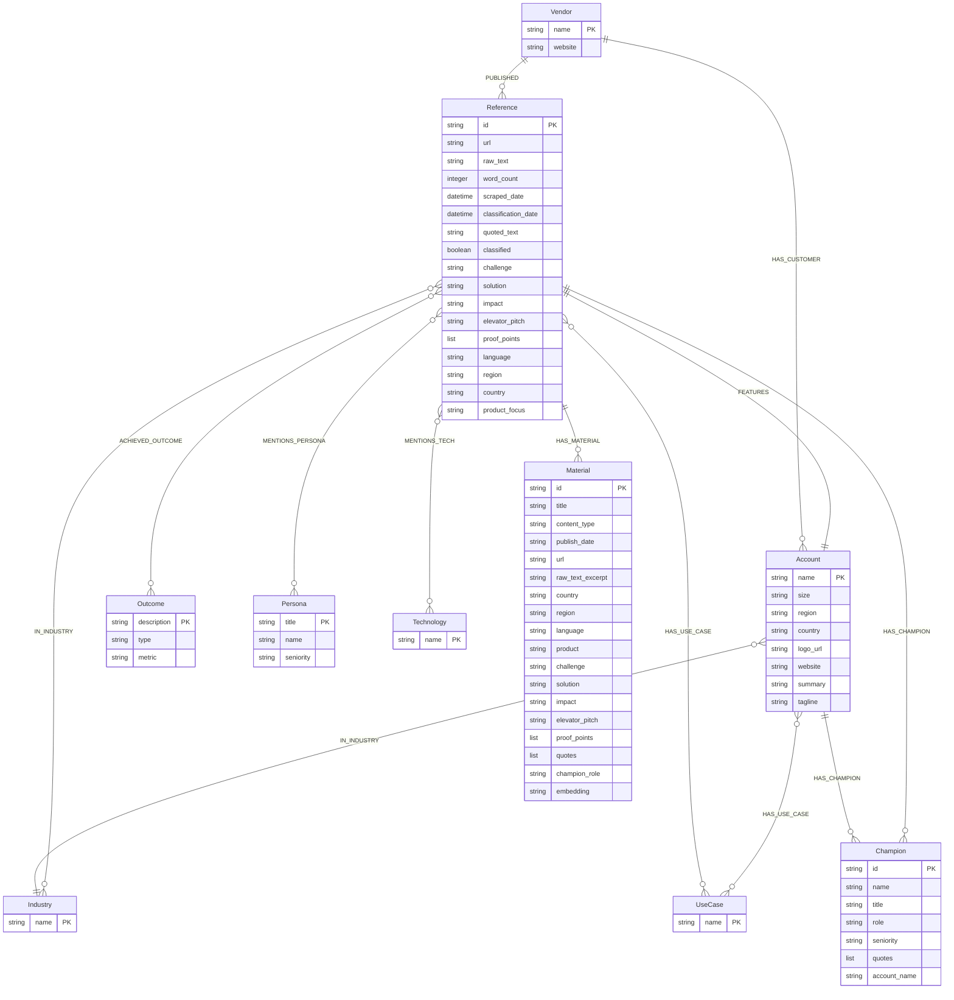

# Advocacy Intelligence Platform

An AI-powered competitive intelligence platform that helps B2B companies discover, analyze, and leverage customer references across their competitive landscape using graph database technology.

## Project Overview

This platform scrapes customer references from competitor websites, classifies them using Google Gemini, stores them in a Neo4j graph database, and enables similarity search to find the best reference matches for sales opportunities.

**Current Phase**: V1 - Proof of Concept  
**Target Industry**: Data/Database companies (Snowflake, Databricks, etc.)

## Features

- **Web Scraping**: Scrapy first (free, fast), then HyperBrowser.ai fallback (for JavaScript-rendered pages)
- **Static Listing Support**: Requests-based discovery with JSON pathname extraction for dynamic Next.js customer directories
- **Individual File Storage**: Each reference saved as `{account-slug}-{timestamp}.json` organized by vendor folder
- **AI Classification**: Google Gemini extracts structured data (industries, use cases, outcomes, personas, tech stacks, champions, reference materials, challenge/solution/impact narratives)
- **Graph Database**: Neo4j AuraDB stores relationships between vendors, accounts, references, champions, and supporting metadata
- **Similarity Search**: Find customer references matching prospect profiles (industry, use case, company size, region)
- **Idempotent Operations**: Safe to re-run scrapers and classifiers without creating duplicates
- **Dual Storage**: Raw content preserved in both individual files and Neo4j for backup and querying

## Tech Stack

- **Python 3.11+** - Backend language
- **Neo4j AuraDB Free** - Graph database (cloud-hosted Neo4j)
- **Google Gemini API** - Content classification (auto-detects best available model, prefers gemini-2.5-flash)
- **Scrapy** - Web scraping framework (first attempt - free, fast)
- **HyperBrowser.ai** - Web scraping service (fallback for JavaScript-rendered pages)
- **requests** - HTTP library for sitemap fetching
- **python-dotenv** - Environment management

## Quick Start

### Prerequisites

- Python 3.11+ (Python 3.9+ works but 3.11+ recommended)
- Neo4j AuraDB Free instance ([sign up here](https://console.neo4j.io/))
- Google API key for Gemini ([get here](https://makersuite.google.com/app/apikey))
- HyperBrowser.ai API key ([optional but recommended, get here](https://hyperbrowser.ai/))

### Installation

1. **Clone the repository:**
```bash
git clone <repository-url>
cd Advocacy-Intelligence
```

2. **Create and activate virtual environment:**
```bash
python3 -m venv venv
source venv/bin/activate  # On Windows: venv\Scripts\activate
```

3. **Install dependencies:**
```bash
pip install -r requirements.txt
```

4. **Set up environment variables:**
```bash
cp .env.example .env
# Edit .env with your credentials:
# - NEO4J_URI, NEO4J_USERNAME, NEO4J_PASSWORD
# - GOOGLE_API_KEY
# - HYPERBROWSER_API_KEY (optional but recommended for JavaScript-heavy sites)
```

5. **Verify setup:**
```bash
python scripts/verify_setup.py
```

6. **Run the pipeline for existing vendors:**
```bash
# Process all enabled vendors
python scripts/run_pipeline.py

# Or process specific vendors
python scripts/run_pipeline.py --vendors mongodb,snowflake
```

### Adding a New Vendor

**Super simple - just 2 steps:**

1. **Add vendor config** to `data/vendors.json` (see [STARTUP_GUIDE.md](docs/STARTUP_GUIDE.md))
2. **Run the pipeline:**
```bash
python scripts/run_pipeline.py --vendors newvendor
```

**That's it!** The pipeline handles everything automatically. See [docs/STARTUP_GUIDE.md](docs/STARTUP_GUIDE.md) for detailed instructions.

## Project Structure

```
Advocacy-Intelligence/
├── README.md                 # This file
├── PROJECT.md                # Comprehensive project documentation
├── agents.md                 # AI assistant context
├── requirements.txt          # Python dependencies
├── .env.example             # Environment variable template
├── .gitignore               # Git ignore rules
├── src/
│   ├── pipeline/            # Unified pipeline system
│   │   ├── __init__.py
│   │   ├── vendor_config.py      # Load vendor configs from JSON
│   │   ├── scraper_registry.py   # Map vendors to scraper classes
│   │   ├── idempotency.py        # Idempotency checks for all phases
│   │   ├── runner.py             # Main PipelineRunner orchestrator
│   │   └── reporting.py          # Summary reports and logging
│   ├── scrapers/            # Web scraping modules
│   │   ├── __init__.py
│   │   ├── universal_scraper.py  # Universal scraper (works for all vendors)
│   │   └── pagination.py          # Pagination utilities
│   ├── classifiers/         # LLM classification modules
│   │   ├── __init__.py
│   │   └── gemini_classifier.py  # Google Gemini classifier
│   ├── graph/               # Neo4j database client
│   │   ├── __init__.py
│   │   └── neo4j_client.py  # Database operations
│   └── utils/               # Utility functions
│       ├── __init__.py
│       ├── file_storage.py   # Individual reference file storage
│       ├── sitemap_discovery.py  # Sitemap-based URL discovery
│       └── scrapy_scraper.py     # Scrapy scraping utility
├── data/
│   ├── vendors.json         # Vendor configuration file
│   ├── taxonomies/          # Classification taxonomies (JSON)
│   │   ├── industries.json
│   │   ├── use_cases.json
│   │   └── company_sizes.json
│   ├── scraped/             # Individual reference files (gitignored)
│   │   └── {vendor}/         # Organized by vendor name
│   │       └── {customer-slug}-{timestamp}.json
│   └── schema/              # Data model definitions
│       └── data_model.json
├── logs/                    # Pipeline logs and reports
│   ├── pipeline_report_*.json
│   └── pipeline_errors_*.log
├── scripts/                 # Orchestration scripts
│   ├── run_pipeline.py     # Unified pipeline runner (processes all vendors)
│   ├── query_mongodb_data.py    # Sample queries for MongoDB data
│   ├── test_pipeline.py    # Test pipeline (legacy)
│   ├── verify_setup.py     # Verify environment setup
│   └── archive/            # Legacy vendor-specific scripts (backward compatibility)
│       ├── discover_urls.py
│       ├── discover_urls_sitemap.py
│       ├── scrape_phase2_mongodb.py
│       └── ...
└── docs/
    ├── SCRAPING_PHASES.md   # Detailed phase documentation
    ├── SITEMAP_DISCOVERY.md # Sitemap-based discovery guide
    ├── MONGODB_PIPELINE_SUMMARY.md  # MongoDB pipeline results
    └── MONGODB_DATA_INSIGHTS.md     # Data insights and analytics
```

## How It Works

The platform follows a **4-phase pipeline** for each vendor:

### Phase 1: URL Discovery

**Two approaches available:**

#### Option A: Sitemap-Based Discovery (Preferred - Fast & Free!)
- **Method**: Parse website sitemaps to extract customer reference URLs
- **Speed**: ~10 seconds vs. hours with pagination
- **Cost**: $0 (free!)
- **Works for**: MongoDB, most modern websites
- **Script**: `scripts/discover_urls_sitemap.py`

```bash
python scripts/discover_urls_sitemap.py mongodb
```

#### Option B: Pagination-Based Discovery (Fallback)
- **Method**: Iterate through paginated listing pages
- **Speed**: Minutes to hours (depends on pages)
- **Cost**: HyperBrowser.ai costs (~$0.01-0.05 per page)
- **Works for**: Redis (Cloudflare protection), Snowflake
- **Script**: `scripts/discover_urls.py` or `scripts/discover_urls_redis.py`

**Output**: List of unique customer reference URLs saved to `data/scraped/{vendor}/discovered_urls-{timestamp}.json`

### Phase 2: Content Scraping

**Process**:
- Uses **Scrapy first** (free, fast) for simple pages (installed in the default venv) — pipeline logs explicitly when Scrapy succeeds
- Falls back to **HyperBrowser.ai** for JavaScript-rendered pages or Cloudflare protection (logs `HyperBrowser.ai` usage when invoked)
- Fetches each reference URL and extracts content
- Prefers markdown format, falls back to HTML
- Filters low-quality scrapes (<100 words)
- Rate limiting: 2-second delays between requests

**Output**: Individual JSON files saved to `data/scraped/{vendor}/{customer-slug}-{timestamp}.json`

**Script**: Use unified pipeline:
- `python scripts/run_pipeline.py --vendors {vendor} --phases 2`

### Phase 3: Database Loading

**Process**:
- Loads scraped references from files into Neo4j
- Creates Reference nodes with raw text
- Links to Vendor nodes
- URL deduplication (safe to re-run)
- Sets `classified=false` flag

**Output**: Reference nodes in Neo4j ready for classification

**Scripts**:
- `scripts/load_and_classify_mongodb.py` - MongoDB (includes classification)
- `scripts/test_pipeline.py` - Snowflake (full pipeline)

### Phase 4: Classification

**Google Gemini Classifier**:
- Auto-detects best available model (prefers `gemini-2.5-flash` for speed/cost)
- Extracts structured data:
  - Customer name, industry, company size, region
  - Use cases (1-3 per reference)
  - Business outcomes (performance, cost savings, etc.)
  - Personas (job titles, seniority)
  - Tech stack mentions
  - Best customer quote
- Uses predefined taxonomies for consistency
- Handles rate limits with exponential backoff
- Updates graph with relationships (Customer, Industry, UseCase, Outcome, etc.)

**Output**: Fully classified and enriched graph data ready for similarity search

### Complete Workflow Example

```bash
# MongoDB (using sitemap - fastest!)
python scripts/discover_urls_sitemap.py mongodb      # Phase 1: ~10 seconds
python scripts/scrape_phase2_mongodb.py              # Phase 2: ~36 minutes
python scripts/load_and_classify_mongodb.py          # Phase 3 & 4: ~47 minutes

# Snowflake (using pagination)
python scripts/discover_urls.py                      # Phase 1: ~5-15 minutes
python scripts/scrape_phase2.py                      # Phase 2: ~30-60 minutes
python scripts/test_pipeline.py                      # Phase 3 & 4: ~10-20 minutes
```

### Graph Storage

**Neo4j Graph Structure**:



**Key Features**:
- Idempotent operations (MERGE, not CREATE)
- Raw text and contextual narratives (challenge, solution, impact, elevator pitch) preserved in Reference nodes
- `classified` flag tracks processing status
- Indexes on Account.name, Reference.url, Vendor.name, Champion.id, Material.id for fast lookups
- Full data model available in `data/schema/data_model.json`

**Node Descriptions**:
- **Vendor**: Company publishing the reference (e.g., Snowflake)
- **Reference**: Case study/video/blog asset capturing raw text plus curated challenge, solution, impact, elevator pitch, proof points, and additional quotes
- **Account**: The customer organization featured in the story (replaces the earlier `Customer` node) with size, geography, web presence, and summary metadata
- **Industry**: Industry classification (Financial Services, Technology, etc.)
- **UseCase**: Use cases addressed (ML/AI, Data Lakehouse, etc.)
- **Outcome**: Business outcomes achieved (performance, cost savings, etc.)
- **Persona**: Job titles and personas featured in the reference
- **Technology**: Technologies mentioned (AWS, dbt, etc.)
- **Champion**: Individual advocates quoted in the story, including role, seniority, attributable quotes, and associated account
- **Material**: Individual marketing assets (case studies, videos, blog posts) linked to the reference with language, product focus, challenge/solution/impact summaries, proof points, and embeddings

## Usage Examples

### Unified Pipeline (Recommended)

**Single script handles all vendors through all phases:**

```bash
# Process all enabled vendors (MongoDB, Snowflake, Redis)
python scripts/run_pipeline.py

# Process specific vendors
python scripts/run_pipeline.py --vendors mongodb,snowflake

# Run specific phases only (e.g., just discovery and scraping)
python scripts/run_pipeline.py --vendors mongodb --phases 1,2

# Skip phases (e.g., skip discovery if URLs already exist)
python scripts/run_pipeline.py --vendors mongodb --skip-phases 1

# Dry run (show what would be processed without executing)
python scripts/run_pipeline.py --dry-run

# Force re-processing (skip idempotency checks)
python scripts/run_pipeline.py --force
```

**Key Features**:
- **Idempotent by default**: Automatically skips URLs/files already processed
- **Cost-effective**: Only processes new content on daily runs
- **Error isolation**: Vendor failures don't break entire pipeline
- **Detailed reporting**: Summary reports saved to `logs/pipeline_report_*.json`

**Daily Run Example**:
```bash
# Run daily to track new case studies (cost-effective!)
python scripts/run_pipeline.py
# Output: Only processes new URLs, skips existing content
# Estimated cost: $0-5 per day (only new content)
```

### Legacy Scripts (Archived)

Old vendor-specific scripts are preserved in `scripts/archive/` for backward compatibility:
- `scripts/archive/discover_urls_sitemap.py` - MongoDB sitemap discovery
- `scripts/archive/scrape_phase2_mongodb.py` - MongoDB content scraping
- `scripts/archive/load_and_classify_mongodb.py` - MongoDB DB load + classify

**File Storage**: Each reference is automatically saved as `{account-slug}-{timestamp}.json` in `data/scraped/{vendor}/`. This enables:
- Local backups of all scraped content
- Easy export to cloud storage (S3, GCS, etc.)
- Version control of individual stories
- Incremental updates without re-scraping everything

To disable file saving, set `SAVE_RAW_DATA=false` in your environment.

### Test Single Page Scraping

```bash
python scripts/test_single_page.py
```

### Verify Setup

```bash
python scripts/verify_setup.py
```

### Query Neo4j Browser

Access Neo4j Browser from your AuraDB console and run queries like:

```cypher
// Count references by industry
MATCH (a:Account)-[:IN_INDUSTRY]->(i:Industry)
RETURN i.name, count(a) as account_count
ORDER BY account_count DESC

// Find references about fraud detection
MATCH (r:Reference)-[:ADDRESSES_USE_CASE]->(uc:UseCase {name: "Fraud Detection"})
MATCH (r)-[:FEATURES]->(a:Account)
RETURN a.name, r.url

// View a specific account's data
MATCH (a:Account {name: "Red Sea Global"})<-[:FEATURES]-(r:Reference)
MATCH (r)-[:ADDRESSES_USE_CASE]->(uc:UseCase)
RETURN a, r, collect(uc.name) as use_cases
```

## Adding a New Vendor

**Protocol**: Follow these steps every time you add a new vendor to the system.

### Step 1: Check for Sitemap (Always Try First!)

```bash
curl -I https://vendor.com/sitemap.xml
```

**If sitemap exists and is accessible:**
- Fast (~10 seconds), free, preferred method
- Skip to Step 3

**If no sitemap or Cloudflare blocks it:**
- Continue to Step 2 (pagination scraper)

### Step 2: Add Vendor Configuration

**No scraper class needed!** The `UniversalScraper` handles all vendors via configuration.

Edit `data/vendors.json` and add vendor entry:

```json
{
  "vendor_key": {
    "name": "Vendor Name",
    "website": "https://vendor.com",
    "discovery_method": "sitemap",
    "scraper_class": "UniversalScraper",
    "enabled": true,
    "error_handling": {
      "retry_on_failure": true,
      "max_retries": 3,
      "skip_on_error": false
    },
    "scraper": {
      "link_patterns": ["/customers/", "/case-studies/"],
      "exclude_patterns": ["/customers/", "?filter="],
      "pagination": {
        "path": "/customers/",
        "strategy": "page_number",
        "page_param": "page",
        "page_size": 12,
        "max_consecutive_empty": 2
      }
    }
  }
}
```

> **Tip:** For static listing pages that require a plain HTTP fetch (e.g., Next.js pages that render JSON payloads), add `"discovery_fetch_method": "requests"` inside the `scraper` block. The universal scraper will fetch the HTML directly and extract `pathname` entries from the embedded JSON to capture every case-study slug.

**Note**: Only include `pagination` config if `discovery_method` is `"pagination"`. For sitemap-based discovery, only `link_patterns` and `exclude_patterns` are needed.

**If using sitemap**, also add to `src/utils/sitemap_discovery.py` → `VENDOR_CONFIGS`:
```python
'vendor_key': {
    'base_url': 'https://vendor.com',
    'sitemap_path': '/sitemap.xml',
    'url_patterns': [r'/customers/', r'/case-studies/'],
    'exclude_patterns': [r'/customers/?$', r'\?', r'#'],
}
```

### Step 3: Test Configuration

```bash
# Dry run to test configuration
python scripts/run_pipeline.py --vendors vendor_key --phases 1 --dry-run

# Test Phase 1 only (URL discovery)
python scripts/run_pipeline.py --vendors vendor_key --phases 1

# Test full pipeline
python scripts/run_pipeline.py --vendors vendor_key
```

### Step 4: Verify Results

- Check `data/scraped/{vendor_key}/` for scraped files
- Check Neo4j Browser for loaded references
- Review `logs/pipeline_report_*.json` for summary

**That's it!** No need to create vendor-specific scripts. The unified pipeline handles all phases automatically.

## Configuration

### Environment Variables

Required:
- `NEO4J_URI` - Neo4j AuraDB connection URI (e.g., `neo4j+s://xxxxx.databases.neo4j.io`)
- `NEO4J_USERNAME` - Usually `neo4j`
- `NEO4J_PASSWORD` - Your AuraDB password
- `GOOGLE_API_KEY` - Google Gemini API key

Optional:
- `HYPERBROWSER_API_KEY` - Required for scraping (highly recommended)
- `SCRAPE_DELAY_SECONDS` - Delay between requests (default: 2)
- `SAVE_RAW_DATA` - Save individual reference files (default: true, set to false to disable)

## Current Status

### Working Features

✅ **URL Discovery**:
- **Sitemap-based discovery** (MongoDB, fast & free!)
- Paginated URL discovery (Snowflake, Redis)
- Automatic completion detection
- URL filtering and deduplication

✅ **Content Scraping**:
- Scrapy first (free, fast) for simple pages
- HyperBrowser.ai fallback for JavaScript/Cloudflare protection
- Quality filtering (<100 words skipped)
- Individual file storage (organized by vendor)

✅ **Classification**:
- Google Gemini integration (auto-detects best model)
- Structured data extraction
- Taxonomy-driven classification
- 100% success rate on MongoDB (234/234)

✅ **Database**:
- Neo4j connection and operations
- Idempotent data loading
- Graph relationship creation
- Statistics queries

✅ **Vendors Supported**:
- **MongoDB**: 234 references (sitemap-based discovery)
- **Snowflake**: 18 references processed (pagination-based)
- **Redis**: 50 references processed (Scrapy-first discovery with JSON pathname fallback)

### Current Data

- **Total References**: 294 (234 MongoDB + 18 Snowflake + 42 Redis)
- **Total Accounts**: 243+ unique accounts (increases as new Redis data is classified)
- **Total Use Cases**: 47 different use cases (will expand with new Redis coverage)
- **Total Industries**: 21 industries
- **Total Outcomes**: 885+ outcome records with metrics

See `docs/MONGODB_DATA_INSIGHTS.md` for detailed analytics.

## Cost Estimates

- **Neo4j AuraDB Free**: $0 (lifetime free tier)
- **Google Gemini**: ~$0.001-0.01 per classification (gemini-2.5-flash is very affordable)
- **Scrapy**: $0 (free!)
- **HyperBrowser.ai**: ~$0.01-0.05 per page (only used when Scrapy fails)
- **Total for 100 references**: ~$0-5 (depends on how many pages need HyperBrowser.ai)

## Troubleshooting

### Scraper Issues

**Problem**: No URLs found
- Check if vendor's page structure changed
- Verify scraper configuration in `data/vendors.json`
- Try manually visiting the paginated URL or sitemap

**Problem**: Content too short (~50 words)
- Scrapy may have been blocked (check for anti-bot indicators)
- Falls back to HyperBrowser.ai automatically
- Check HyperBrowser.ai API key is valid and has credits (if fallback needed)
- Some pages may need different scraping configuration

### Classification Issues

**Problem**: Classification returns None
- Check Google API key is valid
- Verify you have API quota available
- Check Gemini model availability in your region

**Problem**: Low accuracy
- Review taxonomies in `data/taxonomies/`
- Tune prompts in `src/classifiers/gemini_classifier.py`
- Manually QA classifications and adjust

### Database Issues

**Problem**: Connection fails
- Verify AuraDB instance is running
- Check credentials in `.env`
- Test connection in Neo4j Browser first

**Problem**: Duplicate nodes
- Shouldn't happen with MERGE operations (URL deduplication built-in)
- Use cleanup script: `python scripts/cleanup_duplicates.py --all`
- Clear database: `MATCH (n) DETACH DELETE n` (use with caution)

### File Storage Issues

**Problem**: Files not being saved
- Check `SAVE_RAW_DATA` environment variable (default: true)
- Verify write permissions on `data/scraped/` directory
- Check disk space

**Problem**: Want to export files to cloud storage
- Files are organized by vendor: `data/scraped/{vendor}/`
- Easy to sync with `aws s3 sync`, `gsutil`, or `rclone`
- Each file is self-contained JSON with all reference data

## Development Roadmap

### Phase 1: Proof of Concept ✅ (Complete)
- ✅ Project structure
- ✅ UniversalScraper (works for all vendors via configuration)
- ✅ Sitemap-based URL discovery utility
- ✅ Individual file storage (organized by vendor)
- ✅ Gemini classifier
- ✅ Neo4j integration
- ✅ URL deduplication and quality filtering
- ✅ 234 MongoDB references fully processed
- ✅ Data exploration and insights
- ✅ Unified pipeline system (modular engine architecture)
- ✅ Scrapy-first approach (cost-effective scraping)

### Phase 2: Core Platform (Next)
- ⏳ Build similarity search queries
- ⏳ Create basic Streamlit UI
- ⏳ Add Databricks (follow "Adding a New Vendor" protocol)
- ⏳ Add 2-3 more vendors (follow protocol)
- ⏳ Refine classification prompts (improve "Unknown" classifications)

### Phase 3: Scale & Polish
- Add 5+ more vendors (all follow same protocol)
- Advanced filtering and browsing
- User testing
- Production deployment
- Daily automated runs (cost-effective with idempotency)

## Contributing

This is currently a private project. For questions or suggestions, please contact the project maintainer.

## License

TBD - Private/Proprietary for now

## Author

Theo - Neo4j Customer Marketing
