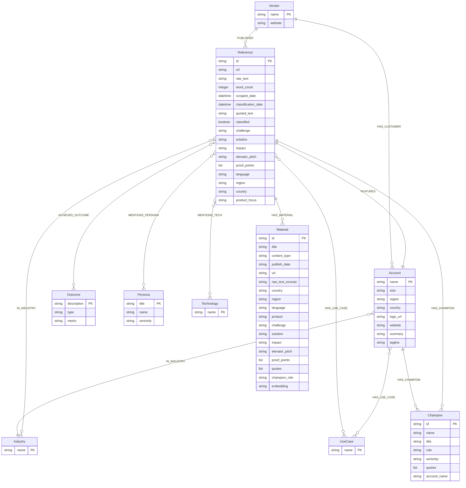

# AI Agent Instructions for Customer Reference Intelligence Platform

This file provides context for AI coding assistants (like Cursor) working on this project.

## Project Overview

This is a competitive intelligence platform for B2B customer marketing teams. We scrape customer references from company websites, classify them using LLMs, store them in a Neo4j graph database, and enable similarity search to find the best reference matches for sales opportunities.

**Current Phase**: V1 - Proof of Concept
**Target Industry**: Data/Database companies (Snowflake, Databricks, etc.)

## 🚨 CRITICAL RULES: Universal Ingestion Protocol

### Rule #1: ONE Universal Way to Ingest Sites

**ALL site ingestion MUST go through `scripts/run_pipeline.py` - NO EXCEPTIONS!**

```bash
# ✅ CORRECT - Use unified pipeline
python scripts/run_pipeline.py --vendors vendor_key

# ❌ WRONG - Never create vendor-specific scripts
python scripts/scrape_vendor.py          # DON'T DO THIS
python scripts/discover_urls_vendor.py  # DON'T DO THIS
python scripts/ingest_vendor.py         # DON'T DO THIS
```

**The unified pipeline (`run_pipeline.py`) handles:**
- ✅ Phase 1: URL Discovery (sitemap or pagination)
- ✅ Phase 2: Content Scraping (with idempotency)
- ✅ Phase 3: Database Loading (with deduplication)
- ✅ Phase 4: Classification (only unclassified)

**If you need to ingest a site:**
1. **Check if vendor exists** in `data/vendors.json`
2. **If exists:** Run `python scripts/run_pipeline.py --vendors vendor_key`
3. **If doesn't exist:** Add vendor config (see "Task: Add a New Vendor" below)
4. **NEVER create new ingestion scripts** - use the pipeline!

### Rule #2: Always Check Before Creating New Code

**Before creating ANY new scraper, script, or vendor configuration:**

1. **Check if it already exists:**
   - `ls src/scrapers/*_scraper.py` - List all scrapers
   - `grep vendor_key data/vendors.json` - Check vendor configs
   - `grep vendor_key src/pipeline/scraper_registry.py` - Check registry

2. **If it exists:**
   - ✅ **DO NOT create a duplicate** - improve/fix the existing code
   - ✅ Read the existing code to understand the current implementation
   - ✅ Make incremental improvements, don't rewrite from scratch

3. **If it doesn't exist:**
   - ✅ Follow the protocol in "Task: Add a New Vendor" section
   - ✅ Check `agents.md` for the exact steps before starting

**This prevents:**
- Duplicate code
- Broken configurations
- Wasted time rewriting working code
- Confusion about which version is correct
- Multiple ways to do the same thing

## Key Technical Context

### Tech Stack
- **Python 3.11+** for all backend code
- **Neo4j AuraDB Free** for graph storage (cloud-hosted Neo4j)
- **Google Gemini API** (auto-detects best available model, prefers gemini-2.5-flash) for content classification
- **Scrapy** for web scraping (first attempt - free, fast)
- **HyperBrowser.ai** for web scraping fallback (JavaScript-rendered pages, Cloudflare protection)
- **requests** for sitemap fetching (sitemap-based discovery)
- **Streamlit** for UI (later phase)
- **python-dotenv** for environment management

### Critical Design Patterns

#### 1. Separation of Concerns - 4-Phase Pipeline
```
Phase 1: URL Discovery → Phase 2: Content Scraping → Phase 3: Database Loading → Phase 4: Classification
```

**Phase 1: URL Discovery**
- **Option A (Preferred)**: Sitemap-based discovery (`scripts/discover_urls_sitemap.py`)
  - Fast (~10 seconds), free, works for MongoDB and most modern sites
  - Parses sitemap XML, filters for customer URLs using regex patterns
- **Option B (Fallback)**: Pagination-based discovery (`scripts/discover_urls.py`)
  - Slower (minutes-hours), costs HyperBrowser.ai, needed for Cloudflare-protected sites
  - Uses flexible pagination system from `scrapers.pagination`
- **Output**: List of URLs saved to `data/scraped/{vendor}/discovered_urls-{timestamp}.json`

**Phase 2: Content Scraping**
- Loads URLs from Phase 1 output files
- Uses **Scrapy first** (free, fast) for simple pages (venv dependency installed by default) and logs when Scrapy succeeds
- Falls back to **HyperBrowser.ai** for JavaScript-rendered pages or Cloudflare protection (logs when fallback is used)
- Saves each reference as individual JSON file: `data/scraped/{vendor}/{customer-slug}-{timestamp}.json`
- Filters low-quality scrapes (<100 words)
- **Script**: Use unified pipeline: `python scripts/run_pipeline.py --vendors {vendor} --phases 2`

**Phase 3: Database Loading**
- Loads scraped references from files into Neo4j
- Creates Reference nodes with raw text
- Links to Vendor nodes
- Sets `classified=false` flag
- URL deduplication (idempotent)

**Phase 4: Classification**
- Queries database for `classified=false` references
- Uses Gemini to extract structured data
- Updates graph with Customer, Industry, UseCase, Outcome, Persona, Technology nodes
- Sets `classified=true` when complete

Each phase is separate and can be run independently. Raw content is always preserved:
- **Individual files**: Each reference saved as `data/scraped/{vendor}/{customer-slug}-{timestamp}.json`
- **Database**: Raw text stored in Neo4j Reference nodes
- **Backup**: Files serve as local backup and enable easy export to cloud storage

#### 2. Idempotent Graph Operations
Always use MERGE, never CREATE for nodes that might already exist:
```python✅ GOOD - Won't create duplicates
session.run("""
MERGE (c:Customer {name: $name})
SET c.size = $size
""", params)❌ BAD - Creates duplicates on re-run
session.run("""
CREATE (c:Customer {name: $name, size: $size})
""", params)

#### 3. Processing Flags
References have a `classified` boolean property:
- `classified=false` means raw text needs classification
- After classification completes, set `classified=true`
- This lets us reprocess if we improve classification prompts

#### 4. Error Handling for External APIs
Always handle rate limits and network errors:
```pythonimport time
import google.generativeai as genai

def classify_with_retry(text, max_retries=3):
    for attempt in range(max_retries):
        try:
            return model.generate_content(...)
        except Exception as e:
            if "429" in str(e) or "quota" in str(e).lower():  # Rate limit
                if attempt < max_retries - 1:
                    time.sleep(2 ** attempt)  # Exponential backoff
                    continue
            print(f"API error: {e}")
            raise

#### 5. Schema Consistency
Use the predefined taxonomies in `data/taxonomies/` for classification:
- `industries.json` - Industry categories
- `use_cases.json` - Use case types
- `company_sizes.json` - Company size bands

Load these into prompts to ensure consistent classification.

## Graph Schema

The complete data model is defined in `data/schema/data_model.json` and can be validated using Neo4j data modeling MCP tools.

### Data Model Diagram



### Core Nodes

**Vendor** - Company publishing the reference
- `name` (PK): Vendor name (e.g., "Snowflake")
- `website`: Vendor website URL

**Reference** - The actual case study/video/blog content enriched with narrative context
- `id` (PK): Unique reference ID (UUID)
- `url`: Source URL
- `raw_text`: Full scraped text content
- `word_count`: Number of words in raw_text
- `scraped_date`: When content was scraped
- `classification_date`: When classification completed
- `quoted_text`: Best customer quote extracted
- `classified`: Processing flag (false = needs classification)
- `challenge`: Summary of the problem highlighted
- `solution`: Summary of the approach taken
- `impact`: Summary of outcomes achieved
- `elevator_pitch`: One-line story recap
- `proof_points`: List of quantitative/qualitative metrics
- `language`: Language of the asset
- `region` / `country`: Geographic focus
- `product_focus`: Primary product or solution emphasized

**Account** - Customer organization featured in the reference (supersedes the earlier `Customer` label)
- `name` (PK): Account name (e.g., "Capital One")
- `size`: Company size (Enterprise, Mid-Market, SMB, Startup, Unknown)
- `region`: Geographic region (North America, EMEA, APAC, LATAM, Unknown)
- `country`: Specific country if mentioned (optional)
- `logo_url`: Public logo link if available
- `website`: Official website
- `summary`: One-sentence description
- `tagline`: Short descriptor or positioning statement

**Industry** - Industry classification
- `name` (PK): Industry name (e.g., "Financial Services", "Technology & Software")

**UseCase** - Use cases addressed
- `name` (PK): Use case name (e.g., "ML/AI & Predictive Analytics", "Data Lakehouse")

**Persona** - Job titles/personas featured
- `title` (PK): Job title (e.g., "Chief Data Officer")
- `name`: Person's name if mentioned
- `seniority`: Seniority level (C-Level, VP, Director, Manager, Individual Contributor)

**Outcome** - Business outcomes achieved
- `description` (PK): Outcome description (e.g., "10x faster queries")
- `type`: Outcome type (performance, cost_savings, revenue_impact, efficiency, other)
- `metric`: Specific metric if mentioned (e.g., "10x", "40% reduction")

**Technology** - Technologies mentioned
- `name` (PK): Technology name (e.g., "AWS", "dbt", "PostgreSQL")

**Champion** - Individuals quoted or highlighted as advocates
- `id` (PK): Stable identifier (slug) for the champion
- `name`: Person's name if available
- `title`: Official job title
- `role`: Commercial role (e.g., Technical Champion, Executive Sponsor)
- `seniority`: Seniority tier (C-Level, VP, Director, Manager, IC, Unknown)
- `quotes`: List of attributable quotes
- `account_name`: Back-reference to the associated account

**Material** - Supporting marketing assets tied to the reference
- `id` (PK): Unique identifier for the asset (slug or URL)
- `title`: Asset title
- `content_type`: case_study, blog, video, webinar, etc.
- `publish_date`: ISO date string if available
- `url`: Canonical asset URL
- `raw_text_excerpt`: Representative excerpt
- `country` / `region` / `language`: Localization metadata
- `product`: Product or solution focus
- `challenge` / `solution` / `impact`: Asset-specific narratives
- `elevator_pitch`: One-line summary
- `proof_points`: Key metrics/claims from the asset
- `quotes`: Quotes captured within the asset
- `champion_role`: How the champion participated (e.g., speaker, quote source)
- `embedding`: Optional vector representation for semantic search

### Core Relationships

```cypher
(Vendor)-[:PUBLISHED]->(Reference)
(Vendor)-[:HAS_CUSTOMER]->(Account)
(Reference)-[:FEATURES]->(Account)
(Account)-[:HAS_REFERENCE]->(Reference)
(Account)-[:IN_INDUSTRY]->(Industry)
(Reference)-[:IN_INDUSTRY]->(Industry)
(Reference)-[:ADDRESSES_USE_CASE]->(UseCase)
(Reference)-[:HAS_USE_CASE]->(UseCase)
(Account)-[:HAS_USE_CASE]->(UseCase)
(Reference)-[:ACHIEVED_OUTCOME]->(Outcome)
(Reference)-[:MENTIONS_PERSONA]->(Persona)
(Reference)-[:MENTIONS_TECH]->(Technology)
(Account)-[:HAS_CHAMPION]->(Champion)
(Reference)-[:HAS_CHAMPION]->(Champion)
(Reference)-[:HAS_MATERIAL]->(Material)
```

### Indexes

- `Account.name` - For fast account lookups
- `Reference.url` - For URL deduplication
- `Vendor.name` - For vendor lookups
- `Champion.id` - For champion retrieval
- `Material.id` - For material retrieval

## Common Tasks & How to Approach Them

### Task: Add a New Vendor

**🚨 MANDATORY: Use `scripts/run_pipeline.py` for ALL ingestion!**

**The unified pipeline is the ONLY way to ingest sites. Never create vendor-specific ingestion scripts.**

**You NEVER need to create new scrapers!** The `UniversalScraper` handles all vendors via configuration.

**For NEW vendors:**
1. **Check if vendor already exists:**
   ```bash
   grep -i "vendor_name" data/vendors.json
   ```

2. **If vendor exists:**
   - ✅ **DO NOT create anything** - vendor is already configured
   - ✅ Use `python scripts/run_pipeline.py --vendors vendor_key` to run it
   - ✅ If it's broken, fix the existing configuration in `data/vendors.json`

3. **If vendor doesn't exist:**
   - Just add configuration to `data/vendors.json` - no Python code needed!

**Key Insight:**
- **ALL vendors** use `UniversalScraper` - no scraper classes needed!
- **Sitemap-based vendors**: Just config in `data/vendors.json` + `src/utils/sitemap_discovery.py`
- **Pagination-based vendors**: Just config in `data/vendors.json` with `pagination` section
- **The pipeline (`run_pipeline.py`) + UniversalScraper** handles everything - you just configure vendors

**Protocol**: Follow these exact steps every time you add a new vendor. This ensures consistency and leverages the unified pipeline system.

#### Step 0: Verify Vendor Doesn't Already Exist

**Before doing anything, check:**
1. Is vendor in `data/vendors.json`?

**If YES:**
- ✅ Use existing configuration
- ✅ Fix/improve existing config, don't duplicate
- ✅ Only proceed if user explicitly asks to recreate from scratch

#### Step 1: Check for Sitemap (ALWAYS Try First!)

```bash
curl -I https://vendor.com/sitemap.xml
```

**If sitemap exists and is accessible:**
- ✅ Fast (~10 seconds), free, preferred method
- Skip to Step 3 (no scraper class needed)

**If no sitemap or Cloudflare blocks it:**
- Continue to Step 2 (create pagination scraper)

#### Step 2: Add Vendor Configuration

**No scraper class needed!** The `UniversalScraper` handles all vendors via configuration.

**Edit `data/vendors.json`** and add vendor entry:

```json
{
  "vendor_key": {
    "name": "Vendor Name",
    "website": "https://vendor.com",
    "discovery_method": "sitemap",
    "scraper_class": "UniversalScraper",
    "enabled": true,
    "error_handling": {
      "retry_on_failure": true,
      "max_retries": 3,
      "skip_on_error": false
    },
    "scraper": {
      "link_patterns": ["/customers/", "/case-studies/"],
      "exclude_patterns": ["/customers/", "?filter="],
      "pagination": {
        "path": "/customers/",
        "strategy": "page_number",
        "page_param": "page",
        "page_size": 12,
        "max_consecutive_empty": 2
      }
    }
  }
}
```

> **Static-page hint:** If the listing page renders a JSON payload (e.g., Next.js) and Scrapy isn't required for discovery, set `"discovery_fetch_method": "requests"` inside the `scraper` block. The universal scraper will fetch the HTML directly and parse embedded `pathname` entries for every case-study slug.

**Note**: Only include `pagination` config if `discovery_method` is `"pagination"`. For sitemap-based discovery, only `link_patterns` and `exclude_patterns` are needed.

**If using sitemap**, also add to `src/utils/sitemap_discovery.py` → `VENDOR_CONFIGS`:

```python
VENDOR_CONFIGS = {
    # ... existing configs ...
    'vendor_key': {
        'base_url': 'https://vendor.com',
        'sitemap_path': '/sitemap.xml',
        'url_patterns': [r'/customers/', r'/case-studies/'],
        'exclude_patterns': [r'/customers/?$', r'\?', r'#'],
    },
}
```

#### Option B: Pagination-Based Discovery (Fallback)
- **Method**: Iterate through paginated listing pages (supports plain `requests` fetch via `"discovery_fetch_method": "requests"` for static Next.js directories)
- **Speed**: Minutes to hours (depends on pages)
- **Cost**: HyperBrowser.ai costs (~$0.01-0.05 per page)
- **Works for**: Redis (Cloudflare protection), Snowflake

#### Step 3: Test Configuration

**🚨 ALWAYS use `run_pipeline.py` - this is the ONLY way to ingest sites!**

```bash
# Dry run to test configuration (no changes made)
python scripts/run_pipeline.py --vendors vendor_key --phases 1 --dry-run

# Test Phase 1 only (URL discovery)
python scripts/run_pipeline.py --vendors vendor_key --phases 1

# Test Phase 2 only (content scraping)
python scripts/run_pipeline.py --vendors vendor_key --phases 2

# Test full pipeline (all 4 phases)
python scripts/run_pipeline.py --vendors vendor_key

# Process multiple vendors
python scripts/run_pipeline.py --vendors mongodb,snowflake,redis

# Skip specific phases
python scripts/run_pipeline.py --vendors vendor_key --skip-phases 4
```

**❌ NEVER create vendor-specific scripts like:**
- `scripts/scrape_vendor.py`
- `scripts/discover_urls_vendor.py`
- `scripts/ingest_vendor.py`
- Any script that bypasses `run_pipeline.py`

#### Step 4: Verify Results

- Check `data/scraped/{vendor_key}/` for scraped files
- Check Neo4j Browser for loaded references
- Review `logs/pipeline_report_*.json` for summary

**That's it!** No need to create vendor-specific scripts. The unified pipeline (`scripts/run_pipeline.py`) handles all phases automatically:
- Phase 1: URL Discovery (sitemap or pagination)
- Phase 2: Content Scraping (with idempotency checks)
- Phase 3: Database Loading (with deduplication)
- Phase 4: Classification (only unclassified references)

**Key Points**:
- ✅ **UniversalScraper handles ALL vendors** - no scraper classes needed!
- ✅ Always try sitemap first (100x faster, free!)
- ✅ Configuration-driven (add to `data/vendors.json` + `sitemap_discovery.py` if using sitemap)
- ✅ **No Python code needed** - just JSON configuration
- ✅ **If vendor exists, fix config - don't duplicate**
- ✅ No vendor-specific scripts needed (use unified pipeline)
- ✅ Fully idempotent (safe to re-run daily)

**Remember:**
- **ALL vendors** use `UniversalScraper` via configuration
- **Always check `data/vendors.json` first** - vendor might already be configured!

**Return schema**:
```python{
'url': str,
'raw_text': str,
'raw_html': str,  # optional
'customer_name': str,  # if obvious from URL/title
'scraped_date': str,  # ISO format
'word_count': int
}
```

**File Storage**: The pipeline automatically saves each reference to `data/scraped/{vendor}/{customer-slug}-{timestamp}.json` using `utils.file_storage.save_reference_file()`. This provides:
- Local backup of all scraped content
- Easy export to cloud storage (S3, GCS, etc.)
- Version control of individual stories
- Incremental updates without re-scraping

To disable file saving, set `SAVE_RAW_DATA=false` in environment variables.

### Task: Improve Classification Prompt

1. Edit `src/classifiers/gemini_classifier.py` (prompts are inline in the `classify` method)
2. Load taxonomies from `data/taxonomies/` into prompt
3. Always request structured JSON output
4. Include examples for clarity
5. Test on 5-10 diverse references before deploying
6. To reprocess everything: Set all references to `classified=false` and re-run

### Task: Add New Graph Query

1. Add to `src/graph/queries.py`
2. Write as a function that takes parameters
3. Return Python data structures (list of dicts), not raw Neo4j results
4. Add docstring with example usage
5. Consider query performance - use indexes if needed:
```cypherCREATE INDEX customer_name IF NOT EXISTS FOR (c:Customer) ON (c.name)
CREATE INDEX reference_url IF NOT EXISTS FOR (r:Reference) ON (r.url)

### Task: Debug Graph Data

**Preferred Method: Use Neo4j MCP Tools**

Always use the Neo4j Cypher MCP tools (`mcp_neo4j-database_read_neo4j_cypher` and `mcp_neo4j-database_write_neo4j_cypher`) for querying the database. These tools provide direct access without needing to write Python code.

**For read queries:**
- Use `mcp_neo4j-database_read_neo4j_cypher` for SELECT/MATCH queries
- Returns results as structured data
- No need to manage Neo4j client connections

**For write queries:**
- Use `mcp_neo4j-database_write_neo4j_cypher` for CREATE/UPDATE/DELETE operations
- Use with caution - prefer idempotent operations

**For schema inspection:**
- Use `mcp_neo4j-database_get_neo4j_schema` to understand the current database structure
- Helps verify data model matches expectations

**For data modeling:**
- Use `mcp_neo4j-data-modeling_*` tools for validating and managing data models
- Useful when adding new node types or relationships

**Example queries using MCP:**
```cypher
// Count references by vendor
MATCH (v:Vendor)-[:PUBLISHED]->(r:Reference)
RETURN v.name, count(r) as ref_count
ORDER BY ref_count DESC

// Find unclassified references
MATCH (r:Reference)
WHERE r.classified = false
RETURN r.url, r.scraped_date
LIMIT 10

// Check a specific customer's data
MATCH (c:Customer {name: "Capital One"})<-[:FEATURES]-(r:Reference)
MATCH (r)-[:ADDRESSES_USE_CASE]->(uc:UseCase)
RETURN c, r, collect(uc.name) as use_cases
```

**Alternative: Neo4j Browser** (accessible from AuraDB console)
- Use for visual exploration and ad-hoc queries
- Good for manual inspection and debugging
- Not suitable for automated queries or scripts

## Common Pitfalls to Avoid

### 1. Don't Create Duplicate Nodes
Always use MERGE with a unique property (usually `name` or `id`)

### 2. Don't Store Secrets in Code
Use environment variables loaded from `.env`:
```pythonfrom dotenv import load_dotenv
import osload_dotenv()
api_key = os.getenv('GOOGLE_API_KEY')

### 3. Don't Scrape Too Fast
Always add delays between requests (2-3 seconds minimum):
```pythonimport timefor url in urls:
data = scrape_url(url)
time.sleep(2)  # Be respectful

### 4. Don't Assume HTML Structure
Websites change. Always:
- Check if elements exist before accessing
- Use try/except for parsing
- Log when expected elements are missing
```pythontry:
customer_name = soup.find('h1', class_='customer-name').text.strip()
except AttributeError:
print(f"Could not find customer name at {url}")
customer_name = "Unknown"

### 5. Don't Ignore API Costs
Google Gemini (gemini-2.5-flash) is very affordable. For v1:
- ~100-200 references to classify
- ~$0.001-0.01 per classification (gemini-2.5-flash is very cost-effective)
- HyperBrowser.ai: ~$0.01-0.05 per page (required for all scraping)
- Total cost: ~$1-5 for v1 dataset (mostly HyperBrowser.ai costs)

Track usage during development.

### 6. Preserve Raw Data in Multiple Formats
Raw scraped content is preserved in two places:
- **Individual JSON files**: `data/scraped/{vendor}/{customer-slug}-{timestamp}.json` - Easy to backup, version, and export
- **Neo4j database**: `Reference.raw_text` property - Queryable, searchable, always available

This dual storage approach ensures:
- Files can be easily pushed to cloud storage or versioned separately
- Database provides fast querying and relationship traversal
- If one storage fails, the other serves as backup

## File Organization Conventions

### Module Naming
- `{vendor}_scraper.py` for scrapers
- `{purpose}_classifier.py` for classifiers
- `{entity}_queries.py` for query modules

### Function Naming
- `scrape_*` for scraping functions
- `classify_*` for classification functions
- `load_*` for database operations
- `get_*` for queries that fetch data
- `create_*` for queries that create data

### Variable Naming
- `*_url` for URLs
- `*_id` for identifiers
- `raw_*` for unprocessed data
- `*_result` for Neo4j results
- `*_data` for Python dicts/lists
- `*_filepath` for file paths

## Testing Approach

For v1, keep testing simple:

1. **Manual QA**: Inspect 10-20 scraped references in Neo4j Browser
2. **Classification accuracy**: Manually review 20 classifications vs source material
3. **Query correctness**: Run similarity search on known examples, verify results make sense
4. **End-to-end**: Scrape vendor → Classify → Query → Visual inspection

Automated tests can come in v2.

## Database Query Best Practices

### Always Use Neo4j MCP Tools

When querying the Neo4j database, **always prefer MCP tools** over writing Python code:

1. **For read queries**: Use `mcp_neo4j-database_read_neo4j_cypher`
   - Direct Cypher query execution
   - Returns structured results
   - No connection management needed

2. **For schema inspection**: Use `mcp_neo4j-database_get_neo4j_schema`
   - Understand current database structure
   - Check node counts and relationships
   - Verify indexes exist

3. **For data modeling**: Use `mcp_neo4j-data-modeling_*` tools
   - Validate data models before implementation
   - Export/import data models
   - Generate Cypher queries for ingestion

4. **For write operations**: Use `mcp_neo4j-database_write_neo4j_cypher` sparingly
   - Prefer idempotent operations (MERGE over CREATE)
   - Use Python Neo4jClient for complex multi-step operations

**Example workflow:**
1. Use `get_neo4j_schema` to understand current structure
2. Use `read_neo4j_cypher` to query data
3. Use `write_neo4j_cypher` only for simple updates
4. Use Python `Neo4jClient` for complex classification updates

## When to Ask for Help

If you encounter:
- Websites with heavy JavaScript or Cloudflare protection (Scrapy tries first, HyperBrowser.ai fallback automatic)
- Gemini API rate limits that can't be solved with exponential backoff
- Neo4j query performance issues
- Classification accuracy below 80% after prompt tuning
- Data model questions (e.g., should this be a node or property?)
- Outcome nodes with null metrics (ensure metric is always a string, even if empty)
- MCP tool connection issues (check Neo4j credentials in environment)

Flag it and ask rather than guessing.

## Architecture Philosophy: Modular Engine, Not Brittle Pipelines

**Core Principle**: Build a modular, scalable engine that works for any vendor, not vendor-specific scripts that break when patterns change.

**Key Design Decisions**:
1. **Abstraction over implementation**: Scraper classes implement common interface, not vendor-specific logic in pipeline
2. **Configuration-driven**: Vendor settings in JSON (`data/vendors.json`), not hardcoded in scripts
3. **Pluggable components**: Discovery methods (sitemap/pagination) are pluggable strategies
4. **Idempotent by design**: Every phase checks existing state before processing
5. **Error isolation**: Vendor failures don't break entire pipeline
6. **Extensible**: Adding new vendor = add config + scraper class, not new pipeline script

**Anti-patterns to avoid**:
- Creating new scripts per vendor (creates maintenance burden)
- Hardcoding vendor-specific logic in pipeline runner
- Assuming all vendors work the same way
- Building pipelines that break when one vendor changes
- Duplicating phase logic across vendor scripts

**Unified Pipeline System**:
- Single entry point: `scripts/run_pipeline.py`
- Processes all vendors through all 4 phases
- Fully idempotent (cost-effective daily runs)
- Configuration-driven (add vendors via `data/vendors.json`)
- Error handling per vendor (continues on failures)

## Current Sprint Focus

**Phase 1: Proof of Concept** ✅ (Complete!)

Tasks:
1. ✅ Set up project structure
2. ✅ Build UniversalScraper (works for all vendors via configuration)
3. ✅ Create sitemap-based URL discovery utility
4. ✅ Load raw data to AuraDB
5. ✅ Create Gemini classification function
6. ✅ Process 234 MongoDB references end-to-end
7. ✅ Data exploration and insights
8. ✅ Build unified pipeline system (modular engine architecture)
9. ✅ Integrate Scrapy-first approach (cost-effective scraping)

### Current Data

- **Total References**: 294 (234 MongoDB + 18 Snowflake + 42 Redis)
- **Total Accounts**: 243+ unique accounts (increasing with newly classified Redis stories)
- **Total Use Cases**: 47 different use cases (expected to increase with Redis coverage)
- **Total Industries**: 21 industries
- **Total Outcomes**: 885+ outcome records with metrics

**Current Status**:
- **MongoDB**: 234 references fully processed (sitemap discovery worked perfectly!)
- **Snowflake**: 18 references processed
- **Redis**: 50 references processed (Scrapy-first discovery with JSON pathname fallback)
- **Unified Pipeline**: Single script processes all vendors with full idempotency

**Next Steps**:
- Build similarity search queries
- Add Databricks (try sitemap first!)
- Create Streamlit UI
- Improve classification accuracy (fix "Unknown" industries/regions)

## Useful Neo4j Cypher Patterns

### Loading raw data
```cypherMERGE (v:Vendor {name: $vendor_name})
CREATE (r:Reference {
id: randomUUID(),
url: $url,
raw_text: $raw_text,
scraped_date: datetime(),
classified: false
})
MERGE (v)-[:PUBLISHED]->(r)
RETURN r.id

### Classification update
```cypherMATCH (r:Reference {id: $ref_id})
SET r.classified = true,
r.classification_date = datetime(),
r.quoted_text = $quoted_textWITH r
MERGE (c:Customer {name: $customer_name})
SET c.size = $size, c.region = $region
MERGE (r)-[:FEATURES]->(c)WITH r
MERGE (i:Industry {name: $industry})
MERGE (c)-[:IN_INDUSTRY]->(i)WITH r
UNWIND $use_cases as uc_name
MERGE (uc:UseCase {name: uc_name})
MERGE (r)-[:ADDRESSES_USE_CASE]->(uc)

### Similarity search skeleton
```cypher// Given a prospect profile, find similar customers
MATCH (c:Customer)-[:IN_INDUSTRY]->(i:Industry {name: $industry})
WHERE c.region = $region AND c.size = $sizeMATCH (c)<-[:FEATURES]-(r:Reference)-[:ADDRESSES_USE_CASE]->(uc:UseCase)
WHERE uc.name IN $use_casesRETURN c, count(DISTINCT r) as ref_count, collect(DISTINCT uc.name) as matching_use_cases
ORDER BY ref_count DESC
LIMIT 10

## Remember

- **🚨 ONE universal way**: ALL ingestion goes through `scripts/run_pipeline.py` - NO EXCEPTIONS
- **Start simple**: Get one vendor working end-to-end before scaling
- **Preserve raw data**: Always keep original scraped text
- **Iterate on prompts**: Classification will improve with tuning
- **Use the graph**: When queries get complex, the graph relationships make them simple
- **Focus on v1 scope**: Resist feature creep until core value is proven
- **Configuration over code**: Add vendors via `data/vendors.json`, not new scripts

## Deprecated/Legacy Scripts

**⚠️ Scripts in `scripts/archive/` are legacy and should NOT be used:**
- `scripts/archive/discover_urls_*.py` - Use `run_pipeline.py --phases 1` instead
- `scripts/archive/scrape_phase2_*.py` - Use `run_pipeline.py --phases 2` instead
- `scripts/archive/load_and_classify_*.py` - Use `run_pipeline.py --phases 3,4` instead

**These exist for reference only. Always use the unified pipeline.**

Good luck! This is going to be a powerful tool.